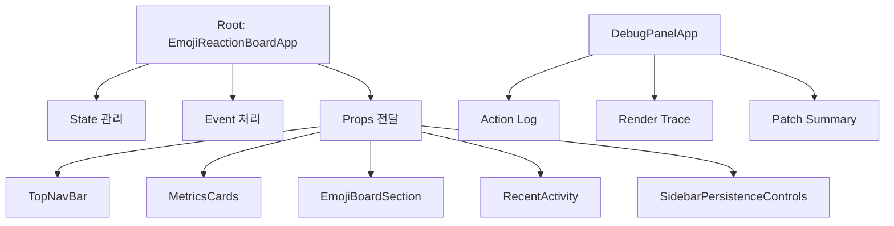
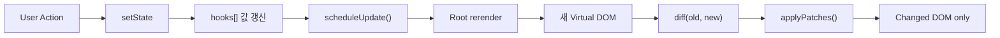

# Baby React

## 구현 개요

기존 Virtual DOM 엔진 위에, **루트 컴포넌트 하나가 Hook과 State를 관리하는 React-like 프로젝트**입니다.

---

## 핵심 설계 선택

| 선택 포인트 | 현재 구현 | 선택 이유 |
| --- | --- | --- |
| 컴포넌트 구조 | 루트 + props-only 자식 | 상태는 한곳에 두고 화면 책임만 분리하기 위해 |
| 상태 위치 | 루트 컴포넌트에 집중 | Hook을 루트에서만 사용한다는 과제 조건을 분명하게 만족하기 위해 |
| Hook 저장 | `hooks[] + hookIndex` | Hook 순서 기반 상태 보존을 가장 작고 직관적으로 보여주기 위해 |
| 상태 변경 처리 | `setState -> scheduleUpdate()` | 상태 변경과 화면 갱신을 자동으로 연결하기 위해 |
| batching | `queueMicrotask()` | 같은 tick의 여러 상태 변경을 1번 렌더로 묶기 위해 |
| 화면 업데이트 | Diff 후 Patch | 전체를 다시 그리지 않고 필요한 부분만 바꾸기 위해 |
| 디버깅 | Debug Panel 추가 | 렌더와 패치 흐름을 시각적으로 보여주기 위해 |

---

## 구조

핵심 구조는 다음과 같습니다.

- 루트 컴포넌트가 상태와 이벤트를 모두 관리합니다.
- 자식 컴포넌트는 `props`만 받아 화면을 렌더링합니다.
- 디버그 패널은 별도 루트로 두어 내부 동작을 분리해서 보여줍니다.

---

## 동작 흐름

이 흐름에서 중요한 포인트는 3가지입니다.

1. 상태는 `FunctionComponent` 인스턴스의 `hooks[]` 배열에 저장됩니다.
2. `setState`는 값만 바꾸는 것이 아니라 update를 예약합니다.
3. update는 새 Virtual DOM을 만든 뒤 Diff/Patch로 최소 반영합니다.

---

## 선택 이유와 대안

| 선택 요소 | 선택 이유 | 대안 |
| --- | --- | --- |
| 상태를 루트에 집중 | Hook을 루트에서만 사용한다는 과제 조건을 만족하고, **Lifting State Up**과 단방향 데이터 흐름을 가장 분명하게 보여줄 수 있기 때문입니다. | 공통 부모 단위로 상태 분산, 전역 store 사용, 자식 컴포넌트 local state 허용 |
| `hooks[] + hookIndex` 사용 | Hook의 핵심인 "호출 순서 기반 상태 보존"을 가장 작고 직관적으로 구현할 수 있고, 설명하기도 쉽기 때문입니다. | `Map` 기반 저장, state/effect/memo 별도 배열, linked list 구조 |
| batching 도입 | 한 번의 사용자 동작 안에서 여러 상태가 바뀌어도 렌더는 한 번만 일어나게 해서, React의 batching 개념을 단순하게 재현할 수 있기 때문입니다. | 즉시 `update()`, `setTimeout`, `requestAnimationFrame`, 전역 스케줄러 |
| Diff/Patch 유지 | 과제 목표인 "전체를 다시 그리지 않고 필요한 부분만 업데이트"를 직접 보여줄 수 있고, 기존 Virtual DOM 엔진도 그대로 활용할 수 있기 때문입니다. | 매 상태 변경마다 전체 DOM 재생성, subtree 단위 교체 |

---

## 현재 구현 vs 실제 React

| 항목 | 현재 구현 | 실제 React |
| --- | --- | --- |
| 상태 단위 | 루트 FunctionComponent 하나 | 각 함수 컴포넌트마다 독립 상태 |
| Hook 사용 위치 | 루트만 허용 | 모든 함수형 컴포넌트 |
| 상태 저장 | `hooks[]` 배열 | Fiber 기반 Hook 구조 |
| batching | `queueMicrotask` 기반 | 더 정교한 scheduler |
| 렌더 비교 | vDOM diff 후 patch | Fiber reconciliation |
| 리스트 처리 | 단순 비교 중심, 일부 keyed diff | 강한 key 기반 reconciliation |
| effect 실행 | patch 직후 flush | 더 정교한 렌더/커밋 단계 분리 |

현재 구현은 실제 React를 완전히 복제하는 데 목적이 있지 않습니다. 대신 아래 요소를 설명하기 쉬운 구조로 압축해 보여주는 데 초점을 둡니다.

- 상태 보존
- Hook 순서
- batching
- Diff/Patch
- Lifting State Up

---
