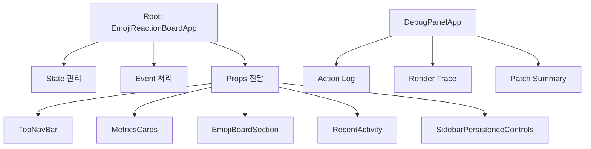
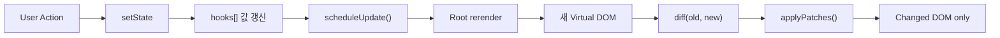

# Baby React

## 과제 구현 방식

**기존 Virtual DOM 엔진 위에, 루트 컴포넌트 하나가 Hook과 State를 관리하는 React-like runtime**

---

## 핵심 포인트

| 포인트 | 구현 방식 | 왜 이렇게 했는가 |
| --- | --- | --- |
| 컴포넌트 구조 | 루트 + props-only 자식 | 상태는 한곳에 두고 화면 책임만 분리하기 위해 |
| 상태 위치 | 루트 컴포넌트에 집중 | Hook은 루트에서만 사용한다는 과제 조건을 가장 분명하게 만족하기 위해 |
| Hook 저장 | `hooks[] + hookIndex` | Hook 순서 기반 상태 보존을 가장 작고 직관적으로 보여주기 위해 |
| 상태 변경 처리 | `setState -> scheduleUpdate()` | 상태 변경과 화면 갱신을 자동으로 연결하기 위해 |
| batching | `queueMicrotask()` | 같은 tick의 여러 상태 변경을 1번 렌더로 묶기 위해 |
| 화면 업데이트 | Diff 후 Patch | 전체를 다시 그리지 않고 필요한 부분만 바꾸기 위해 |
| 디버깅 | Debug Panel 추가 | 렌더/패치 흐름까지 눈으로 보여주기 위해 |

---

## 동작 구조

핵심은 단순합니다.

- 루트 컴포넌트가 상태와 이벤트를 모두 가집니다.
- 자식 컴포넌트는 `props`만 받아서 화면만 그립니다.
- 디버그 패널은 별도 루트로 두어 내부 동작을 따로 보여줍니다.

---

## 우리 런타임이 동작하는 방식

이 흐름에서 우리가 강조하는 포인트는 3개입니다.

1. 상태는 `FunctionComponent` 인스턴스의 `hooks[]` 배열에 남습니다.
2. `setState`는 값만 바꾸는 것이 아니라 update를 예약합니다.
3. update는 새 Virtual DOM을 만든 뒤 Diff/Patch로 최소 반영합니다.

---

## 왜 이런 선택을 했는가

### 상태를 왜 루트에 몰았나?

- 과제 조건이 "Hook은 루트에서만 사용"이었기 때문입니다.
- 동시에 **Lifting State Up**을 가장 분명하게 보여줄 수 있습니다.
- 데이터 흐름이 단방향이라 발표에서 설명하기 쉽습니다.

다른 방식:

- 공통 부모별로 상태를 나누기
- 전역 store 사용
- 자식 컴포넌트도 local state 허용

### Hook을 왜 `hooks[] + hookIndex`로 구현했나?

- Hook의 핵심은 "호출 순서 기반 상태 보존"이기 때문입니다.
- 배열과 인덱스만으로도 그 원리를 가장 작게 구현할 수 있습니다.
- 교육용 설명력이 높습니다.

다른 방식:

- `Map` 기반 저장
- state/effect/memo 별도 배열
- linked list 구조

### 왜 batching을 넣었나?

- 버튼 클릭 한 번에 여러 상태가 바뀌어도 렌더는 한 번만 일어나게 하기 위해서입니다.
- React의 batching 개념을 가장 간단하게 재현할 수 있습니다.

다른 방식:

- 즉시 `update()`
- `setTimeout`
- `requestAnimationFrame`
- 전역 스케줄러

### 왜 Diff/Patch를 유지했나?

- 과제 목표가 "전체를 다시 그리지 않고 필요한 부분만 업데이트"였기 때문입니다.
- 기존 Virtual DOM 엔진을 그대로 활용할 수 있습니다.
- 상태 변경과 DOM 최소 수정의 연결을 직접 보여줄 수 있습니다.

다른 방식:

- 매 상태 변경마다 전체 DOM 재생성
- subtree 단위 교체

---

## 우리 구현 vs 실제 React

| 항목 | 우리 구현 | 실제 React |
| --- | --- | --- |
| 상태 단위 | 루트 FunctionComponent 하나 | 각 함수 컴포넌트마다 독립 상태 |
| Hook 사용 위치 | 루트만 허용 | 모든 함수형 컴포넌트 |
| 상태 저장 | `hooks[]` 배열 | Fiber 기반 Hook 구조 |
| batching | `queueMicrotask` 기반 | 더 정교한 scheduler |
| 렌더 비교 | vDOM diff 후 patch | Fiber reconciliation |
| 리스트 처리 | 단순 비교 중심, 일부 keyed diff | 강한 key 기반 reconciliation |
| effect 실행 | patch 직후 flush | 더 정교한 렌더/커밋 단계 분리 |

