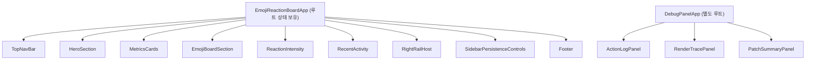
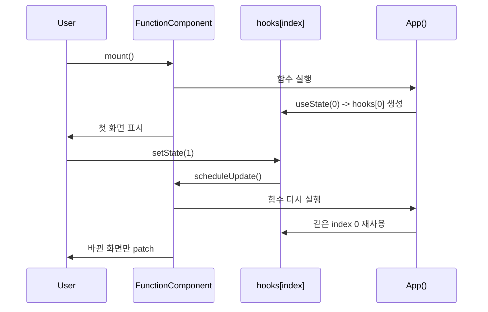
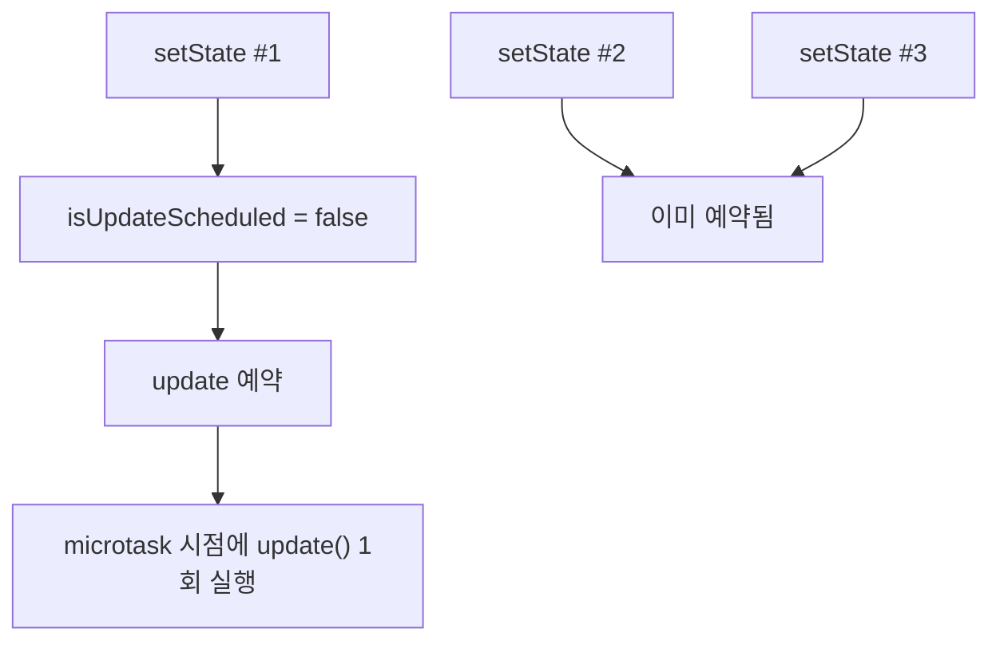

Readme.md

# Baby React

---

## 1. 프로젝트 한 줄 요약

이 프로젝트는 **React의 핵심 아이디어인 Component, State, Hooks, Virtual DOM Diff/Patch를 직접 구현**하고, 그 위에 **사용자 입력에 따라 화면이 바뀌는 웹 페이지**를 만든 결과물입니다.

핵심 포인트는 세 가지입니다.

1. `FunctionComponent` 클래스가 함수형 컴포넌트 실행, Hook 상태 보존, 재렌더를 책임집니다.
2. 상태는 루트 컴포넌트에만 두고, 자식 컴포넌트는 `props`만 받는 순수 함수로 유지했습니다.
3. 상태 변경 시 전체 DOM을 다시 그리지 않고 `Virtual DOM -> Diff -> Patch` 흐름으로 바뀐 부분만 반영합니다.

---

## 2. 지금 구현된 Baby React의 전체 구조

```mermaid
flowchart LR
    A["사용자 입력(click / input / submit)"] --> B["이벤트 핸들러 실행"]
    B --> C["useState의 setState 호출"]
    C --> D["hooks[index].value 갱신"]
    D --> E["scheduleUpdate()로 microtask 예약"]
    E --> F["루트 함수 컴포넌트 재실행"]
    F --> G["새 Virtual DOM 생성"]
    G --> H["이전 Virtual DOM과 diff"]
    H --> I["patch 목록 생성"]
    I --> J["applyPatches로 실제 DOM 최소 변경"]
    J --> K["useEffect flush"]
```

### 런타임 레이어

| 레이어 | 파일 | 역할 |
| --- | --- | --- |
| Runtime | `src/runtime/FunctionComponent.js` | 루트 컴포넌트 mount/update, Hook 배열 관리, effect flush, batching |
| Hooks | `src/runtime/hooks.js` | `useState`, `useEffect`, `useMemo` 구현 |
| Context | `src/runtime/context.js` | 현재 렌더링 중인 인스턴스와 root/child 구분 |
| Component Resolve | `src/runtime/createElement.js`, `src/runtime/resolveVNodeTree.js` | 함수형 컴포넌트를 `COMPONENT_NODE`로 만들고 실제 vnode tree로 해석 |
| VDOM Engine | `src/lib/diff.js`, `src/lib/applyPatches.js`, `src/lib/renderTo.js`, `src/lib/vdomToDom.js` | Diff/Patch 및 DOM 반영 |
| Demo App | `src/demo/app/EmojiReactionBoardApp.js` | 루트 상태, 파생 데이터, UI 조립 |
| Debug Panel | `src/demo/panel/DebugPanelApp.js` | 공개 debug snapshot을 구독해 렌더/패치 시각화 |

---

## 3. UI를 어떻게 Component로 나눴는가?

### 실제 컴포넌트 분해

### 컴포넌트 분해 특징

| 구분 | 어떻게 나눴는가 | 이유 |
| --- | --- | --- |
| 화면 골격 | `TopNavBar`, `HeroSection`, `Footer` | 정적인 UI를 분리해 루트의 책임을 줄임 |
| 핵심 상호작용 | `EmojiBoardSection`, `SidebarPersistenceControls` | 사용자 액션이 어디서 발생하는지 분명하게 보이게 함 |
| 파생 정보 | `MetricsCards`, `ReactionIntensity`, `RecentActivity` | 같은 상태를 다양한 뷰로 보여주기 좋음 |
| 디버깅 | `DebugPanelApp`을 별도 루트로 분리 | 루트 Hook 제한을 지키면서도 상태 있는 패널을 추가하기 위함 |

### 왜 이 분해가 과제 요구사항에 잘 맞는가?

- 자식 컴포넌트 대부분이 **state 없이 props만 받아서 렌더링**합니다.
- 따라서 "상태는 위로 올리고 자식은 stateless하게 유지"라는 요구사항을 가장 직관적으로 보여줍니다.
- 루트가 데이터와 동작을 가지고, 자식은 그 결과를 보여주는 역할입니다.

---

## 4. State는 어디에 두었는가?

### 현재 구조

상태는 `EmojiReactionBoardApp` 루트에 집중돼 있습니다.

| 상태 | 의미 |
| --- | --- |
| `votes` | 이모지별 투표 수 |
| `selectedEmoji` | 현재 선택 강조 대상 |
| `recentReactions` | 최근 반응 목록 |
| `savedAt` | 마지막 저장 시각 |
| `lastAction` | 마지막 사용자 액션 메타데이터 |
| `debugRailWidth` | 디버그 레일 너비 |
| `debugRailDragState` | 드래그 중인지 여부 |

`DebugPanelApp`도 별도 루트이기 때문에 자신의 `snapshot`, `activeTab` 상태를 가질 수 있습니다. 중요한 점은 **같은 트리 안의 자식 컴포넌트는 Hook을 쓰지 않는다**는 것입니다.

### 왜 루트에 몰아두었는가?

1. 과제 제약을 정확히 만족합니다.
2. 상태 흐름이 단방향이어서 디버깅이 쉽습니다.
3. 자식은 화면 표현만 담당하므로 재사용과 테스트가 쉬워집니다.
4. Hook 상태 보존 로직을 루트 한 군데에서만 다루면 구현 난이도가 크게 낮아집니다.

### 이 선택의 장단점

| 장점 | 단점 |
| --- | --- |
| 구현이 단순하다 | 루트가 커지기 쉽다 |
| Hook 규칙을 강제하기 쉽다 | 상태가 많아질수록 루트가 비대해진다 |
| 발표에서 설명이 쉽다 | 실제 대규모 앱 구조와는 거리가 있다 |

---

## 5. 함수는 매번 다시 실행되는데 상태는 어떻게 유지되는가?

이 과제의 가장 중요한 질문입니다.

정답은 **컴포넌트 함수 바깥에 있는 `FunctionComponent` 인스턴스가 `hooks[]` 배열을 계속 들고 있기 때문**입니다.

### 핵심 원리

- 첫 렌더에서 `useState`는 `hooks[index]`에 값을 저장합니다.
- 다음 렌더에서 같은 순서로 `useState`가 호출되면 같은 `index`를 다시 읽습니다.
- 그래서 함수는 새로 실행되지만 상태는 인스턴스에 남아 있습니다.

### 그래서 Hook 순서가 중요한 이유

이 구현은 Hook을 **호출 순서로 식별**합니다.

- 첫 번째 `useState` -> `hooks[0]`
- 두 번째 `useState` -> `hooks[1]`
- 첫 번째 `useEffect` -> `hooks[2]`

Hook 순서가 바뀌면 다른 슬롯을 읽게 되므로, 코드에서 아예 `Hook order changed between renders.` 에러를 던지도록 설계돼 있습니다.

---

## 6. 요구사항이 얼마나 반영되었는가?

### 요구사항 체크표

| 요구사항 | 반영 여부 | 구현 방식 | 평가 |
| --- | --- | --- | --- |
| 함수형 컴포넌트 사용 | 반영 | `createElement(type=function)` -> `COMPONENT_NODE` 생성 | 충족 |
| `FunctionComponent` 클래스 구현 | 반영 | `hooks[]`, `mount()`, `update()` 보유 | 충족 |
| Hook은 최상위 컴포넌트에서만 사용 | 반영 | `context.js`의 render kind 검사 | 충족 |
| State는 루트에서만 관리 | 반영 | 앱 상태를 루트에 집중, 자식은 props-only | 충족 |
| 자식 컴포넌트는 Stateless | 대부분 반영 | `TopNavBar`, `MetricsCards` 등 자식은 Hook 없음 | 충족 |
| `useState` 구현 | 반영 | Hook 슬롯에 값 저장, setter 제공 | 충족 |
| `useEffect` 구현 | 반영 | deps 비교, cleanup, commit 후 실행 | 충족 |
| `useMemo` 구현 | 반영 | deps 같으면 캐시 재사용 | 충족 |
| 상태 변경 시 자동 재렌더 | 반영 | `setState -> scheduleUpdate -> update()` | 충족 |
| Virtual DOM + Diff + Patch | 반영 | 새 VDOM 생성 후 `diff()` / `applyPatches()` | 충족 |
| 사용자 입력에 따른 화면 변화 | 반영 | 이모지 클릭, 저장, 복원, 초기화, 패널 탭 전환 | 충족 |
| 외부 프레임워크 금지 | 반영 | React/Vue 미사용, 자체 런타임 구현 | 충족 |

### 추가로 잘한 부분

| 추가 요소 | 의미 |
| --- | --- |
| Microtask batching | 여러 `setState`를 한 번의 update로 묶음 |
| Debug snapshot API | 렌더 횟수, patch 요약, 액션 로그를 시각화 |
| Keyed diff 일부 지원 | key가 있는 리스트에서 index 기반보다 안정적인 비교 가능 |
| 테스트 77개 | 구현 설명을 테스트 근거로 뒷받침 가능 |

---

## 7. Hook들은 어떻게 구현되어 있는가?

### `useState`

| 항목 | 구현 |
| --- | --- |
| 저장 위치 | `instance.hooks[index]` |
| 초기화 | 첫 렌더에서만 `resolveInitialValue(initialValue)` 실행 |
| 업데이트 | `setState(nextValue)` |
| 함수형 업데이트 | 지원 |
| 동일 값 최적화 | `Object.is`로 같으면 update 생략 |

### `useEffect`

| 항목 | 구현 |
| --- | --- |
| deps 저장 | Hook 슬롯에 `deps`, `cleanup` 저장 |
| 실행 시점 | DOM patch 이후 `flushEffects()` |
| cleanup | deps 변경 시 이전 cleanup 먼저 호출 |
| 실제 사용처 | `document.title`, drag 이벤트 등록/해제 |

### `useMemo`

| 항목 | 구현 |
| --- | --- |
| 캐시 조건 | deps가 동일하면 이전 value 재사용 |
| 실제 사용처 | `totalVotes`, `sortedResults`, `topReaction`, `topPercentage`, `visibleRecentReactions` |
| 목적 | 파생 데이터를 매 렌더마다 무조건 다시 계산하지 않기 |

### 왜 이렇게 만들었는가?

- 과제의 핵심 질문이 "상태를 어디에 보존할 것인가"이기 때문에 가장 본질적인 방식인 **Hook 슬롯 배열**을 택했습니다.
- 구현 난이도 대비 설명력이 좋습니다.
- 실제 React처럼 완전하지는 않지만, Hook의 작동 원리를 이해하기에는 매우 적합합니다.

---

## 8. `setState`는 상태 변경 외에 무엇을 해야 하는가?

이 프로젝트에서 `setState`는 단순히 값만 바꾸지 않습니다.

### 실제로 하는 일

1. 이전 값과 새 값을 비교합니다.
2. 값이 달라졌다면 Hook 슬롯의 값을 갱신합니다.
3. debug용 상태 변경 이유를 기록합니다.
4. 즉시 렌더하지 않고 `scheduleUpdate()`를 호출합니다.
5. 같은 tick 안에서는 중복 예약을 막고, microtask에서 한 번만 `update()`를 실행합니다.

### 이 설계가 중요한 이유

상태 변경 직후 바로 DOM을 건드리면:

- 같은 이벤트 안의 여러 `setState`가 중복 렌더를 일으키고
- 불필요한 diff/patch가 많아지고
- 설명도 복잡해집니다.

따라서 이 구현은 "state 변경"과 "렌더 예약"을 분리해서 React스러운 흐름을 흉내 냅니다.

---

## 9. 여러 상태 변경을 한 번에 처리하는 방법: Batching

### 현재 구현

`FunctionComponent.scheduleUpdate()`가 `isUpdateScheduled` 플래그와 `queueMicrotask()`를 사용합니다.

### 이 구현의 장점

- 같은 이벤트 핸들러 안에서 여러 `setState`가 나와도 update는 1번만 일어납니다.
- 발표에서 batching 개념을 명확히 보여주기 쉽습니다.
- 구현이 짧고 안정적입니다.

### 왜 microtask를 선택했는가?

- 코드가 간단합니다.
- 브라우저 이벤트 핸들러 직후 빠르게 flush됩니다.
- 과제 수준에서 "동일 tick 묶기"를 보여주기 충분합니다.

### 한계

- React처럼 우선순위 스케줄링은 없습니다.
- 여러 루트를 전역 큐로 관리하지 않습니다.
- 비동기 작업 사이의 더 정교한 batching 정책은 없습니다.

---

## 10. Virtual DOM + Diff + Patch는 어떻게 연결돼 있는가?

### 현재 동작 흐름

| 단계 | 설명 |
| --- | --- |
| 1 | 루트 컴포넌트를 다시 실행해 새 VDOM 생성 |
| 2 | `resolveVNodeTree()`로 `COMPONENT_NODE`를 실제 element/text 트리로 풀기 |
| 3 | 이전 VDOM과 새 VDOM을 `diff()` |
| 4 | `TEXT`, `PROPS`, `REPLACE`, `ADD`, `REMOVE` patch 생성 |
| 5 | `applyPatches()`가 실제 DOM에 최소 변경 적용 |
| 6 | 그 다음 `useEffect` 실행 |

### 이 구현의 특징

| 특징 | 설명 |
| --- | --- |
| 초기 렌더 | `renderTo()`로 한 번에 mount |
| 이후 업데이트 | `diff + applyPatches` 경로 사용 |
| keyed diff | 일부 지원 |
| MOVE patch | 없음, 이동은 `REMOVE + ADD`로 표현 |
| fallback | 루트 DOM이 사라지면 `renderTo()`로 다시 그림 |

### 왜 이런 구조가 좋은가?

- 과제의 "전체를 다시 그리지 않고 필요한 부분만 업데이트" 목표와 직접 연결됩니다.
- Week 3에서 만든 VDOM 엔진을 그대로 활용했다는 점을 강조할 수 있습니다.
- mount와 update 경로를 분리해서 설명하기 쉽습니다.

---

## 11. 중점 포인트별 분석

### 11-1. UI를 어떻게 Component로 나눌 것인가?

현재 구현은 **"데이터를 보여주는 단위" 기준으로 컴포넌트를 나눴습니다.**

- 상단 소개
- 메트릭 카드
- 이모지 보드
- 최근 활동
- 저장/복원 컨트롤
- 디버그 패널

이렇게 나누면 각 컴포넌트가 화면의 한 영역을 책임지고, 루트는 상태와 이벤트만 조립하면 됩니다.

### 11-2. State는 어디에 두는 것이 좋은가?

이번 과제에서는 **루트에 두는 것이 가장 좋습니다.**

이유는 세 가지입니다.

1. 과제 제약을 그대로 만족합니다.
2. 상태 흐름을 추적하기 쉽습니다.
3. Hook 구현 범위를 루트로 제한해 복잡도를 크게 줄입니다.

### 11-3. `setState`는 상태 변경 외에 무엇을 해야 할까?

현재 구현 기준으로 `setState`는 아래 역할을 같이 수행해야 합니다.

- 상태 변경
- 변경 감지
- update 예약
- batching
- debug 정보 기록

즉, `setState`는 "값 바꾸기 함수"가 아니라 **렌더 사이클을 시작하는 진입점**입니다.

### 11-4. 여러 상태 변경을 한 번에 처리하는 방법은?

현재 구현은 `queueMicrotask` 기반 batching입니다.

- 같은 tick이면 update 1번
- diff/patch도 1번
- effect flush도 1번 흐름으로 정리됨

발표에서 "React도 여러 상태 변경을 묶어 처리한다"는 개념을 연결하기 좋습니다.

### 11-5. 중점 포인트를 그렇게 구현한 이유는?

이 프로젝트는 실제 React를 완전히 복제하려는 목적보다, **핵심 아이디어를 가장 설명하기 쉬운 형태로 드러내는 것**을 우선했습니다.

즉,

- 루트 상태 집중
- 순서 기반 Hook 슬롯
- microtask batching
- patch 최소화

이 네 가지는 모두 **학습용 설명력과 구현 안정성의 균형**을 맞춘 선택입니다.

---

## 12. 우리 구현 vs 실제 React

| 항목 | 우리 구현 | 실제 React |
| --- | --- | --- |
| 상태 저장 위치 | `FunctionComponent.hooks[]` 배열 | Fiber 노드에 Hook 체인 저장 |
| Hook 사용 범위 | 각 루트 컴포넌트에서만 허용 | 모든 함수형 컴포넌트에서 가능 |
| 컴포넌트 재실행 | 루트 함수 전체 재실행 | Fiber 단위로 더 정교하게 스케줄 |
| batching | `queueMicrotask` + 플래그 | 더 복잡한 스케줄러와 자동 batching |
| 렌더링 우선순위 | 없음 | 있음 |
| concurrent rendering | 없음 | 있음 |
| diff | 단순 트리 비교 + 일부 keyed diff | 훨씬 정교한 reconciliation |
| 이동 처리 | `REMOVE + ADD`, `MOVE` 없음 | 내부적으로 더 효율적으로 처리 가능 |
| effect | commit 후 단순 flush | layout/passive effect 등 더 세분화 |
| child component hook | 불가 | 가능 |
| JSX 생태계 | 없음, `createElement` 직접 호출 | JSX, Babel, DevTools, ecosystem 풍부 |

### 발표에서 이렇게 말하면 좋습니다

> "우리 구현은 실제 React의 전체 기능을 재현한 것은 아니지만, React가 왜 Hook 호출 순서를 지켜야 하는지, 왜 batching이 필요한지, 왜 Virtual DOM diff가 필요한지를 직접 보여주는 축약판입니다."

---

## 13. 요구사항을 만족하면서도 만들 수 있는 다른 방식

### 대안 1. 루트 상태를 여러 `useState` 대신 하나의 객체로 관리

| 항목 | 현재 방식 | 대안 방식 |
| --- | --- | --- |
| 상태 구조 | `votes`, `selectedEmoji`, `savedAt` 등 여러 Hook 슬롯 | `const [state, setState] = useState({...})` 하나로 관리 |
| 장점 | 상태 의미가 분리돼 읽기 쉽다 | 한 번의 `setState`로 전체 업데이트가 자연스럽다 |
| 단점 | 관련 상태를 여러 번 갱신할 수 있다 | 상태 필드 접근이 길어지고 부분 업데이트가 번거롭다 |

### 대안 2. `FunctionComponent` 대신 전역 render 스케줄러 사용

| 항목 | 현재 방식 | 대안 방식 |
| --- | --- | --- |
| update 예약 | 인스턴스별 `isUpdateScheduled` | 전역 큐에 인스턴스를 모아 flush |
| 장점 | 구현이 단순하다 | 여러 루트를 더 체계적으로 batch 가능 |
| 단점 | 루트 간 협업이 약하다 | 구현 복잡도가 올라간다 |

### 대안 3. child component도 Hook 허용

| 항목 | 현재 방식 | 대안 방식 |
| --- | --- | --- |
| Hook 범위 | 루트만 허용 | 모든 함수형 컴포넌트 허용 |
| 장점 | 과제 제약을 명확히 지킨다 | 실제 React와 더 비슷해진다 |
| 단점 | 실제 React와는 다르다 | 각 child마다 인스턴스/Hook 저장소/Fiber 비슷한 구조가 필요 |

### 대안 4. diff에서 이동을 `MOVE` patch로 직접 표현

| 항목 | 현재 방식 | 대안 방식 |
| --- | --- | --- |
| 리스트 이동 | `REMOVE + ADD` | `MOVE` patch 추가 |
| 장점 | 구현이 단순하다 | DOM 재생성을 줄일 수 있다 |
| 단점 | 이동 비용이 더 크다 | patch 엔진과 정렬 로직이 복잡해진다 |

### 대안 5. batching을 `requestAnimationFrame` 기반으로 구현

| 항목 | 현재 방식 | 대안 방식 |
| --- | --- | --- |
| flush 시점 | microtask | 다음 프레임 |
| 장점 | 반응이 빠르다 | 프레임 기준으로 시각적 묶음이 쉬움 |
| 단점 | 세밀한 제어는 부족 | 업데이트 반영이 더 늦어질 수 있다 |

---

## 14. 이 프로젝트를 더 업그레이드할 수 있는 부분

### 우선순위 높은 개선점

| 개선 아이디어 | 이유 |
| --- | --- |
| child component Hook 지원 | 실제 React와의 거리를 가장 크게 줄여 줌 |
| unmount 시 effect cleanup 보장 | 현재보다 lifecycle 완성도가 높아짐 |
| 더 정교한 keyed reconciliation | 리스트 업데이트 효율 개선 |
| `MOVE` patch 도입 | DOM churn 감소 |
| 전역 scheduler 도입 | 여러 루트 동시 처리에 유리 |
| 개발자 도구 확장 | Hook 값, patch path, render 원인 분석 강화 |

### 코드 품질 관점 개선점

| 개선 아이디어 | 설명 |
| --- | --- |
| 초기 localStorage read 최적화 | 현재 루트 함수가 다시 실행될 때 저장소를 반복 조회하는 부분을 더 깔끔하게 정리 가능 |
| 데모 엔트리 명칭 정리 | `mountCodingSprintBoard()`가 실제로는 emoji board를 마운트하는 이름 불일치 정리 필요 |
| README와 실제 동작 지속 동기화 | 발표 자료와 실행 기준이 어긋나지 않게 관리 필요 |

---