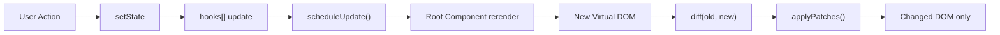
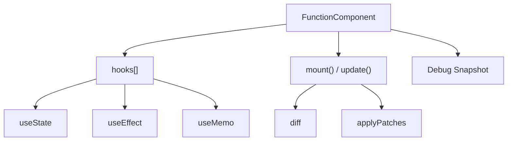
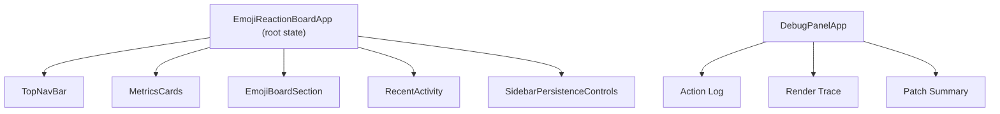

# Baby React

React의 핵심 개념인 **Component, State, Hooks, Virtual DOM Diff/Patch**를 직접 구현하고, 그 위에 **이모지 반응 보드 데모**를 만든 프로젝트입니다.

## 한눈에 보기

| 질문 | 답 |
| --- | --- |
| 무엇을 만들었나? | React-like runtime + 동작하는 demo app |
| 핵심 제약은? | Hook은 루트에서만 사용, 자식은 props-only |
| 상태는 어디 있나? | 루트 컴포넌트에 집중 |
| 상태가 바뀌면? | 새 Virtual DOM 생성 -> Diff -> Patch |
| 차별점은? | Debug Panel로 렌더/패치 흐름까지 시각화 |

## 구조

## 구현 포인트

| 항목 | 구현 방식 | 의미 |
| --- | --- | --- |
| Component | 함수형 컴포넌트 + `COMPONENT_NODE` | 컴포넌트도 vnode로 관리 |
| State | 루트 컴포넌트의 `hooks[]` 배열 | 함수가 다시 실행돼도 상태 유지 |
| Hooks | `useState`, `useEffect`, `useMemo` | React 핵심 기능 직접 구현 |
| Rendering | `mount()` 후 `update()`에서 Diff/Patch | 전체 DOM 재생성 방지 |
| Batching | `queueMicrotask()` | 여러 `setState`를 1번 렌더로 묶음 |

## UI 설계

- 루트 컴포넌트가 상태와 이벤트를 관리합니다.
- 자식 컴포넌트는 `props`만 받아 렌더링합니다.
- 과제의 **Lifting State Up** 요구사항을 그대로 반영했습니다.

## 데모에서 보이는 것

| 사용자 행동 | 화면 변화 | 설명 포인트 |
| --- | --- | --- |
| 이모지 클릭 | 투표 수, 1위 반응, 최근 활동 변경 | 루트 상태 갱신 |
| Save | 브라우저 저장소 저장 | `useEffect`/상태 관리 |
| Reset | 라이브 상태 초기화 | 재렌더 확인 |
| Restore | 저장 상태 복원 | 상태 복구 흐름 |
| Debug Panel 확인 | 액션, 렌더 추적, 패치 요약 표시 | 내부 동작 시각화 |

## 왜 이런 구조를 선택했나?

| 선택 요소 | 현재 구현 | 선택 이유 | 다른 방식 |
| --- | --- | --- | --- |
| 컴포넌트 구조 | 루트 + props-only 자식 | 상태는 한곳에 두고 화면 책임은 분리하기 위해 | 자식도 독립 state 보유 |
| 상태 위치 | 루트에 집중 | 루트 Hook 제약과 Lifting State Up을 명확히 보여주기 위해 | 공통 부모별 분산, 전역 store |
| Hook 저장 | `hooks[] + hookIndex` | Hook 순서 기반 상태 보존을 가장 작게 설명할 수 있어서 | `Map`, 타입별 배열, linked list |
| 상태 변경 처리 | `setState -> scheduleUpdate()` | 상태 변경과 화면 갱신을 자동 연결하기 위해 | `setState -> 즉시 update()` |
| batching | `queueMicrotask()` | 같은 tick의 여러 변경을 1회 렌더로 묶기 쉬워서 | `setTimeout`, `requestAnimationFrame`, 전역 큐 |
| 렌더 업데이트 | Diff 후 Patch | 전체 재렌더 대신 필요한 부분만 바뀌게 하기 위해 | subtree 교체, 전체 DOM 재생성 |

## 우리 구현 vs 실제 React

| 항목 | 우리 구현 | 실제 React |
| --- | --- | --- |
| Hook 사용 범위 | 루트만 허용 | 모든 함수형 컴포넌트 |
| 상태 저장 | `hooks[]` 배열 | Fiber 기반 구조 |
| batching | 단순 microtask | 더 정교한 scheduler |
| diff | 단순 트리 비교 + 일부 keyed diff | 고도화된 reconciliation |
| concurrent rendering | 없음 | 있음 |

## 한 줄 정리

이 프로젝트는 실제 React를 완전히 복제하려는 것이 아니라, **상태 보존, Hook 순서, batching, Diff/Patch, Lifting State Up**을 가장 설명하기 쉬운 형태로 압축 구현한 결과물입니다.

