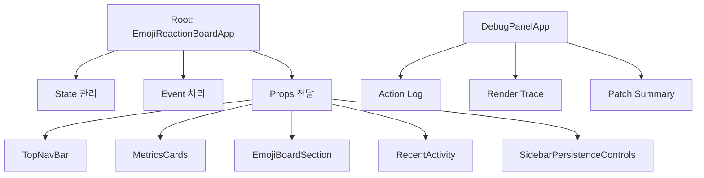
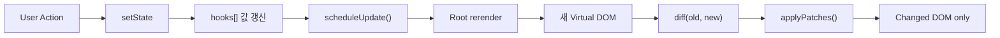

# Baby React

## 1. 무엇을 구현했는가

React의 핵심 개념인 **Component, State, Hooks**를 직접 구현하고,  
그 구현이 실제로 동작한다는 것을 보여주기 위해 **이모지 반응 보드 데모**를 만든 프로젝트입니다.

핵심 구현은 기존 Virtual DOM 엔진 위에, **루트 컴포넌트 하나가 Hook과 State를 관리하는 React-like runtime**을 올리는 방식으로 구성했습니다.

---

## 2. 어떻게 만들었는가

현재 구조의 핵심은 단순합니다.

- 루트 컴포넌트 하나가 상태와 Hook을 모두 관리합니다.
- 자식 컴포넌트는 상태 없이 `props`만 받아서 화면만 그립니다.
- 상태는 한곳에 모으고, 화면은 역할별로 나눠서 구성했습니다.

---

## 3. 왜 이렇게 만들었는가

이 구조를 선택한 이유는 과제 조건에 맞추기 위해서입니다.

- Hook은 루트에서만 사용
- 자식 컴포넌트는 stateless하게 유지
- 상태는 위로 올려서 관리

즉, **Lifting State Up**을 가장 분명하게 보여주는 형태로 설계했습니다.

| 선택 포인트 | 현재 구현 | 선택 이유 |
| --- | --- | --- |
| 컴포넌트 구조 | 루트 + props-only 자식 | 상태는 한곳에 두고 화면 책임만 분리하기 위해 |
| 상태 위치 | 루트 컴포넌트에 집중 | Hook을 루트에서만 사용한다는 과제 조건을 만족하기 위해 |
| 디버깅 | Debug Panel 추가 | 내부 동작도 같이 보여주기 위해 |

---

## 4. 상태는 어떻게 유지되는가

함수형 컴포넌트는 렌더마다 다시 실행되지만, 상태는 함수 안에 저장하지 않습니다.  
상태는 `FunctionComponent` 안의 `hooks[]` 배열에 저장합니다.

그리고 렌더할 때마다 Hook을 같은 순서로 다시 읽게 해서, 함수는 다시 실행돼도 상태는 유지되도록 만들었습니다.

| 저장 방식 | 의미 |
| --- | --- |
| `hooks[]` | Hook 값이 실제로 저장되는 배열 |
| `hookIndex` | 렌더마다 Hook 호출 순서를 맞추는 인덱스 |
| 호출 순서 유지 | 같은 Hook이 같은 슬롯을 다시 사용하도록 보장 |

이 방식은 Hook의 핵심인 **"호출 순서 기반 상태 보존"** 을 가장 단순하게 보여줍니다.

---

## 5. `setState`와 batching은 어떻게 동작하는가

`setState`는 값을 바꾸는 것에서 끝나지 않습니다.

1. 값이 실제로 바뀌었는지 확인합니다.
2. 바뀌었으면 Hook 슬롯 값을 갱신합니다.
3. 바로 렌더하지 않고 다음 렌더를 예약합니다.

그리고 같은 순간에 여러 상태가 바뀌어도 `queueMicrotask()`를 이용해 렌더는 한 번만 일어나게 했습니다.  
이것이 현재 구현의 batching입니다.

| 항목 | 현재 구현 | 의미 |
| --- | --- | --- |
| 상태 변경 처리 | `setState -> scheduleUpdate()` | 상태 변경과 화면 갱신을 자동 연결 |
| batching | `queueMicrotask()` | 같은 tick의 여러 변경을 1번 렌더로 묶음 |

---

## 6. 화면은 어떻게 바뀌는가

상태가 바뀌면 루트 컴포넌트가 다시 실행되고, 새 Virtual DOM이 만들어집니다.  
그다음 이전 Virtual DOM과 새 Virtual DOM을 비교해서 바뀐 부분만 찾고, 그 부분만 실제 DOM에 반영합니다.

즉, 전체 화면을 다시 그리는 것이 아니라 **필요한 부분만 업데이트**합니다.

| 선택 요소 | 선택 이유 | 대안 |
| --- | --- | --- |
| `hooks[] + hookIndex` 사용 | Hook의 핵심인 "호출 순서 기반 상태 보존"을 가장 작고 직관적으로 구현할 수 있기 때문입니다. | `Map` 기반 저장, state/effect/memo 별도 배열, linked list 구조 |
| batching 도입 | 한 번의 사용자 동작 안에서 여러 상태가 바뀌어도 렌더는 한 번만 일어나게 하기 위해서입니다. | 즉시 `update()`, `setTimeout`, `requestAnimationFrame`, 전역 스케줄러 |
| Diff/Patch 유지 | "전체를 다시 그리지 않고 필요한 부분만 업데이트"를 직접 보여줄 수 있기 때문입니다. | 전체 DOM 재생성, subtree 단위 교체 |

---

## 7. 데모에서 보여주는 것

데모에서는 런타임이 실제로 동작하는 흐름을 바로 확인할 수 있습니다.

| 데모 행동 | 확인할 수 있는 동작 |
| --- | --- |
| 이모지 클릭 | 루트 상태 변경 -> 여러 UI 동시 갱신 |
| Debug Panel 확인 | 액션 로그, 렌더 추적, patch 요약 표시 |
| Save | 상태를 브라우저 저장소에 저장 |
| Reset | 현재 라이브 상태만 초기화 |
| Restore | 저장된 상태를 다시 복원 |

즉, 데모는 화면 자체보다 **런타임의 동작을 눈으로 확인하는 장치**에 가깝습니다.

---

## 8. 현재 구현 vs 실제 React

물론 현재 구현은 실제 React와 완전히 같지는 않습니다.

| 항목 | 현재 구현 | 실제 React |
| --- | --- | --- |
| 상태 단위 | 루트 FunctionComponent 하나 | 각 함수 컴포넌트마다 독립 상태 |
| Hook 사용 위치 | 루트만 허용 | 모든 함수형 컴포넌트 |
| 상태 저장 | `hooks[]` 배열 | Fiber 기반 Hook 구조 |
| batching | `queueMicrotask` 기반 | 더 정교한 scheduler |
| 렌더 비교 | vDOM diff 후 patch | Fiber reconciliation |
| 리스트 처리 | 단순 비교 중심, 일부 keyed diff | 강한 key 기반 reconciliation |
| effect 실행 | patch 직후 flush | 더 정교한 렌더/커밋 단계 분리 |

현재 구현은 실제 React를 완전히 복제하는 것보다, 아래 요소를 **설명하기 쉬운 구조로 압축해서 보여주는 것**에 초점을 둡니다.

- 상태 보존
- Hook 순서
- batching
- Diff/Patch
- Lifting State Up

---