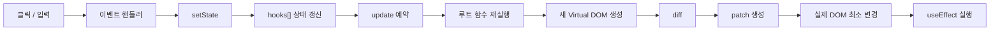
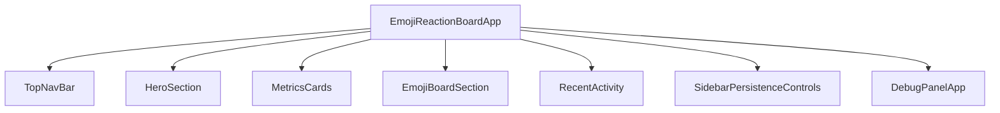
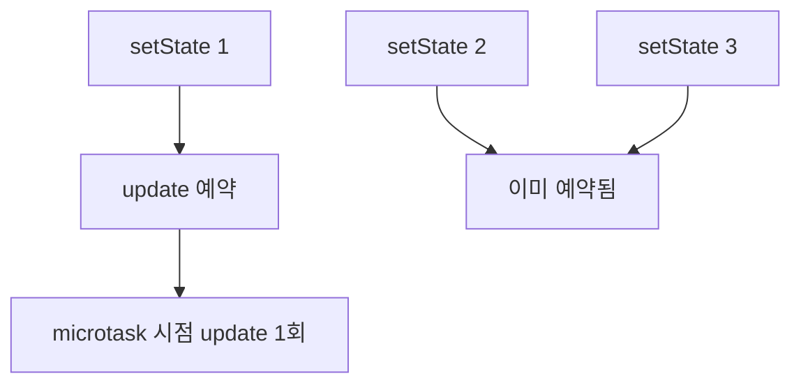

# Presenter Guide

## 1. 이 프로젝트를 한 문장으로 설명하면

이 프로젝트는 **React의 핵심 개념을 직접 구현한 작은 React-like 런타임** 과 **이모지 반응 보드 데모와 디버그 패널**을 올린 웹페이지입니다.

- 실제 엔트리포인트: `src/demo/main.js`
- 기본 마운트 앱: `mountEmojiReactionBoard()`
- 디버그 패널: 별도의 `FunctionComponent` 루트로 마운트

발표에서 가장 중요한 메시지는 아래 한 줄입니다.

> "우리는 React를 사용한 것이 아니라, React가 왜 그렇게 동작하는지를 직접 구현해서 보여줬다."

---

## 2. 발표자가 꼭 알고 있어야 할 구조

### 전체 흐름

### 핵심 파일

| 파일 | 역할 | 발표 포인트 |
| --- | --- | --- |
| `src/runtime/FunctionComponent.js` | 루트 컴포넌트 실행, Hook 저장, mount/update, batching | "함수형 컴포넌트를 감싸는 클래스" |
| `src/runtime/hooks.js` | `useState`, `useEffect`, `useMemo` 구현 | "상태와 부수효과를 직접 구현" |
| `src/runtime/context.js` | root/child 렌더 구분 | "Hook은 루트에서만 허용" |
| `src/runtime/resolveVNodeTree.js` | `COMPONENT_NODE`를 실제 vnode tree로 해석 | "컴포넌트를 즉시 실행하지 않고 해석 단계 분리" |
| `src/lib/diff.js` | 이전/새 VDOM 비교 | "바뀐 부분만 찾음" |
| `src/lib/applyPatches.js` | patch를 실제 DOM에 적용 | "전체 DOM을 갈아끼우지 않음" |
| `src/demo/app/EmojiReactionBoardApp.js` | 실제 데모 앱 | "루트 상태 집중 구조" |
| `src/demo/panel/DebugPanelApp.js` | 렌더/패치 시각화 | "발표용 차별점" |

---

## 3. 과제 요구사항과 실제 구현 연결

| 요구사항 | 실제 구현 | 설명 포인트 |
| --- | --- | --- |
| 함수형 컴포넌트 | `createElement(type=function)` -> `COMPONENT_NODE` | 컴포넌트도 vnode로 취급 |
| `FunctionComponent` 클래스 | `hooks[]`, `mount()`, `update()` | 과제 핵심 구현 |
| Hook은 루트에서만 사용 | `isRootRender()` 검사 | child Hook 금지 |
| 상태는 루트에서만 관리 | `EmojiReactionBoardApp`가 상태 보유 | Lifting State Up |
| 자식은 stateless | `MetricsCards`, `RecentActivity` 등 | props-only 렌더링 |
| `useState` | Hook 슬롯에 값 저장 | 상태 유지 원리 |
| `useEffect` | patch 후 `flushEffects()` | cleanup과 deps 비교 포함 |
| `useMemo` | deps 같으면 캐시 재사용 | 파생 데이터 최적화 |
| Diff/Patch | `diff()` + `applyPatches()` | 변경된 DOM만 반영 |
| 동작하는 웹 페이지 | 이모지 보드 + 저장/복원 + 디버그 패널 | 사용자 입력에 따라 화면 변화 |

---

## 4. 발표에서 꼭 강조할 중점 포인트

### 4-1. UI를 어떻게 Component로 나눴는가?

- 루트는 상태와 이벤트를 가짐
- 자식은 화면 단위로 분리
- 자식은 props만 받아 렌더링

설명 문장:

> "루트는 데이터와 동작을 가지고, 자식은 그 결과를 보여주는 역할만 맡았습니다."

### 4-2. State는 어디에 두는 것이 좋은가?

이번 과제에서는 **루트에 두는 것이 가장 적절합니다.**

이유:

1. 과제 제약을 정확히 만족함
2. 상태 흐름을 추적하기 쉬움
3. Hook 구현 복잡도가 낮아짐
4. 발표할 때 설명이 쉬움

### 4-3. `setState`는 상태 변경 외에 무엇을 해야 하나?

`setState`는 아래 역할을 같이 합니다.

1. Hook 슬롯 값 갱신
2. 같은 값이면 update 생략
3. update 이유 기록
4. 렌더를 즉시 실행하지 않고 예약
5. 여러 상태 변경을 batching

설명 문장:

> "`setState`는 값을 바꾸는 함수가 아니라, 다음 렌더를 시작시키는 함수입니다."

### 4-4. 여러 상태 변경을 어떻게 한 번에 처리했는가?

`queueMicrotask()`로 같은 tick의 업데이트를 1번으로 묶습니다.

설명 문장:

> "상태가 세 번 바뀌어도 렌더는 한 번만 일어나게 만들었습니다."

---

## 5. 상태는 어떻게 유지되는가?

핵심은 `FunctionComponent`가 함수 바깥에서 `hooks[]` 배열을 계속 들고 있다는 점입니다.

예시:

- 첫 번째 `useState` -> `hooks[0]`
- 두 번째 `useState` -> `hooks[1]`
- 첫 번째 `useEffect` -> `hooks[2]`

함수는 다시 실행되지만, 같은 순서의 Hook은 같은 슬롯을 다시 읽기 때문에 상태가 유지됩니다.

설명 문장:

> "함수는 새로 실행되지만, 상태는 컴포넌트 인스턴스 안의 Hook 배열에 남아 있습니다."

---

## 6. 우리 구현 vs 실제 React

| 항목 | 우리 구현 | 실제 React |
| --- | --- | --- |
| Hook 사용 범위 | 루트만 허용 | 모든 함수형 컴포넌트 |
| 상태 저장 | `hooks[]` 배열 | Fiber 기반 구조 |
| batching | microtask 기반 | 더 정교한 자동 batching |
| diff | 단순 비교 + 일부 keyed diff | 고도화된 reconciliation |
| concurrent rendering | 없음 | 있음 |
| child state | 없음 | 가능 |

발표용 한 줄 요약:

> "실제 React보다 단순하지만, React의 핵심 원리를 가장 직접적으로 보여주는 축약판입니다."

---

## 7. 이 프로젝트의 차별점

| 차별점 | 발표에서 어떻게 말할까 |
| --- | --- |
| 직접 구현한 Hook 런타임 | "React를 쓰지 않고 React의 핵심을 구현했습니다." |
| 상태 변화가 보이는 데모 | "클릭 한 번에 여러 UI가 동시에 바뀝니다." |
| Debug Panel | "렌더와 patch를 눈으로 확인할 수 있습니다." |
| 테스트 기반 검증 | "설명뿐 아니라 테스트로도 검증했습니다." |

---

## 8. 예상 질문과 짧은 답변

### Q. 왜 child 컴포넌트에서 Hook을 막았나요?

A. 과제의 제약을 정확히 반영했고, 상태 흐름을 단순하게 유지하기 위해서입니다.

### Q. 실제 React랑 가장 큰 차이는 무엇인가요?

A. Fiber와 concurrent rendering이 없고, child component Hook도 지원하지 않는다는 점입니다.

### Q. 왜 Virtual DOM을 썼나요?

A. 상태가 바뀔 때 전체 DOM을 다시 그리지 않고, 바뀐 부분만 찾아서 반영하기 위해서입니다.

### Q. batching은 왜 필요하나요?

A. 여러 상태 변경이 연속으로 발생해도 렌더를 한 번만 일으켜 효율을 높이기 위해서입니다.

---

## 9. 발표용 데모 시연 순서

### 추천 시연 흐름

1. 앱 첫 화면을 보여주며 "직접 만든 React-like 런타임 위에서 돌아가는 데모"라고 소개
2. 이모지 버튼 하나를 눌러 총 투표 수, 1위, 최근 활동이 동시에 바뀌는 장면 시연
3. 오른쪽 Debug Panel에서 액션 로그, 렌더 추적, 패치 요약이 함께 바뀌는 것 확인
4. `save` 버튼을 눌러 localStorage 저장 시연
5. 몇 번 더 투표 후 `reset`으로 라이브 상태만 초기화되는 것 확인
6. `restore`로 저장 상태를 복원하며 state/effect 흐름 설명
7. 마지막으로 "이 모든 흐름이 루트 상태 + Hook 슬롯 + Diff/Patch로 연결된다"로 마무리

### 시연 포인트 한 줄 요약

| 액션 | 보여줄 개념 |
| --- | --- |
| 이모지 클릭 | `setState`, batching, diff/patch |
| metric 변화 | props 기반 자식 재렌더 |
| recent activity 변화 | 리스트 렌더링 |
| debug panel 변화 | 공개 debug API |
| save/restore/reset | effect, persistence, 상태 복원 |

---

## 10. 검증 결과

현재 저장소 기준 검증 결과는 아래와 같습니다.

- `npm test -- --run`: **77개 테스트 통과**
- `npm run build`: **성공**

즉, 발표 자료의 설명은 현재 동작하는 코드와 테스트 기준에 맞춰 정리돼 있습니다.

---

## 11. 마지막 마무리 문장

> "저희 프로젝트는 React를 흉내 낸 UI가 아니라, React가 왜 Hook 순서를 지키는지, 왜 상태를 위로 올리는지, 왜 diff와 batching이 필요한지를 직접 구현으로 설명할 수 있는 결과물입니다."

